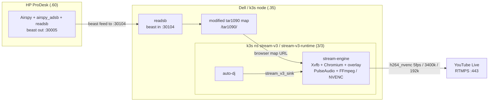
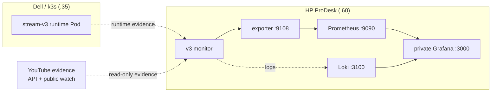
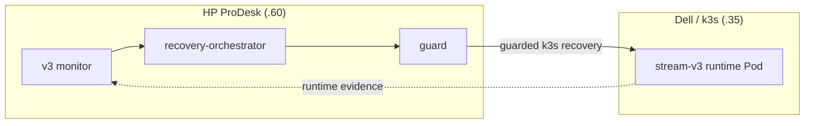
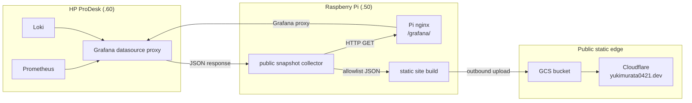

# stream_v3

[](https://github.com/yukimurata0421/live-stream-systems-case-study/actions/workflows/public-snapshot-check.yml)
[](pyproject.toml)
[](LICENSE)

[](https://www.youtube.com/@yukimurata0421/live)

**Live stream:** <https://www.youtube.com/@yukimurata0421/live>
**Public status snapshot:** <https://yukimurata0421.dev/>
([boundary note](docs/v3/public-status-snapshot.md))

This repository publishes `stream_v3` as a public systems case study for a
self-built 24/7 YouTube Live pipeline. ADS-B visualization and NCS music are the
workload; the primary focus is pipeline development, SLI-based monitoring,
observability, recovery guard design, and operational decision-making.

This is open-source code published as a case study, not a supported OSS product
or general-purpose starter.

## Reviewer Summary

`stream_v3` is a public systems case study of a self-built 24/7 YouTube Live
delivery pipeline.

The main result is not simple uptime. The system has been operated through a
monthly-window same-URL review while preserving the public YouTube Live identity
and absorbing recoverable delivery faults through fast recovery, staged
remediation, and SLI-based monitoring.

It demonstrates:

- k3s runtime operation for the delivery workload;
- delivery-plane / observability-plane separation;
- same-URL continuity as a production invariant;
- public-safe status publication through GCS + Cloudflare;
- TCP stall / WAN-session fault classification;
- recovery guard design that avoids unsafe YouTube lifecycle mutation.

This is a single-operator, three-home-host reliability case study, not a
commercial multi-tenant service or a supported OSS starter.

## Evidence Snapshot

The strongest measurements are intentionally front-loaded here, with their
limits attached:

| Signal | Measured result | Boundary |
| --- | --- | --- |
| k3s service restart drill | 10.7 seconds from fault injection to stream_v3 observability metrics OK; the same FFmpeg PID and TCP socket survived, and `bytes_sent` advanced by 37,503,068 bytes across the drill. | This proves k3s control-plane / observability recovery and RTMPS process continuity for this fault. It is not a node reboot, disk restore, RTMPS reconnect, or readsb/tar1090 source-recovery drill. |
| Viewer-facing impact during that drill | YouTube ingest, public watch, same-URL, and watchdog metrics stayed OK in the sampled window; no monitored viewer-facing interruption was observed. | Prometheus/YouTube sampling does not prove every delivered frame. |
| Error-budget reading | The k3s drill burned at most 10.7 seconds of control-plane availability; monitored viewer-facing burn was treated as zero because the same RTMPS socket continued sending and public signals stayed OK. | Long-window reliability claims remain in the 14-day / 28-day SLI docs. |
| Transport MTTR baseline | Historical `tcp_stall` clusters had 90.0s median local transport MTTR, 1190.8s p95, and 1474.0s max. | Local transport MTTR is not direct viewer MTTR. |
| Same-URL continuity review | The 28-day same-URL review recorded `pass`, selected replacement actions `0`, allowed replacement decisions `0`, and candidate-new-URL evidence `0`; the v3 strict same-URL sample window was `6558 / 6568`, `99.848%`. | This is a retained historical review window, not a current uptime promise or proof that every delivered frame was audited. |

Scope calibration: this is a single-operator, three-home-host personal 24/7
stream with real production operation and a GCS/Cloudflare static edge, but not
a commercial multi-tenant service or a contractual user SLO. The repository is
meant to show reliability discipline at small blast radius, not to imply
enterprise traffic scale.

## What This Repository Demonstrates

### Production-style Operation

- 24/7 YouTube Live delivery operation.
- Same public YouTube Live URL preservation as a production invariant.
- Daily recoverable fault absorption through fast recovery, staged remediation,
  and explicit guardrails.
- ADS-B source-chain boundary: Airspy on HP ProDesk, `airspy_adsb`, readsb,
  Dell-side readsb and a modified tar1090 map endpoint, then `stream_v3`
  delivery.

### Runtime And Recovery Architecture

- k3s runtime boundary for browser rendering, audio, AutoDJ, FFmpeg, NVENC, and
  RTMPS delivery.
- Failure classification across rendering, audio, FFmpeg, RTMPS, API, and
  monitoring paths.
- Delivery-plane / observability-plane separation across Dell workstation and
  HP ProDesk hardware.
- HP ProDesk observability role: YouTube resolver/watchdog, stream watchdog,
  subsystem SLI, notifications, Prometheus exporter, recovery orchestrator,
  and private Prometheus/Loki/Grafana.
- Recovery guard design that keeps monitors from directly owning FFmpeg.
- Scoped recovery authority for same-URL-preserving Auto DJ and RTMPS FFmpeg
  recovery.
- Shadow mode and cutover safety before destructive actions.
- Contract tests for unsafe recovery prevention and stale evidence handling.

### Observability And Public Evidence

- Raspberry Pi public publisher role: collect public-safe evidence through the
  Pi-local nginx `/grafana/` proxy to the HP ProDesk Grafana datasource proxy,
  build static JSON/assets, and push them outbound to GCS.
- Public-safe status presentation: Cloudflare serves the GCS snapshot without
  sending public reads through the home uplink or exposing Grafana, Prometheus,
  Loki, raw logs, credentials, or home-network ingress to
  `yukimurata0421.dev` readers.
- `ops/monitoring` evidence path with Prometheus, Loki, Grafana, and Alloy
  configuration.
- YouTube API quota-aware monitoring.

### Reliability Evidence

- SLI methodology that separates production invariants, primary SLIs,
  guardrails, secondary SLIs, and incident metrics.
- 28-day same-URL review with replacement-action counters kept separate from
  availability ratios.
- TCP stall root-cause split across delivery TCP state, WAN identity,
  non-YouTube anchors, YouTube lifecycle evidence, and recovery policy.
- k3s service restart drill with same FFmpeg PID/TCP socket continuity.
- Fast-recovery classifier replay over retained events.

| What breaks | How stream_v3 protects it |
| --- | --- |
| Airspy, `airspy_adsb`, ProDesk readsb, or the Dell readsb / modified tar1090 map feed gets stale. | Source freshness is treated as ADS-B evidence, separate from browser/audio/encoder failure. |
| Browser, audio, FFmpeg, RTMPS, or GPU encoding stalls. | The Dell `stream_v3` k3s delivery tier owns local runtime recovery without giving monitors direct FFmpeg ownership. |
| YouTube API/public evidence, k3s runtime evidence, or monitoring state gets stale or misleading. | The HP ProDesk observability tier pulls read-only YouTube and runtime evidence, applies quota/freshness guards, and only then requests staged k3s recovery. |
| The public status site gets confused with the monitoring backend or starts consuming home uplink bandwidth. | Private Prometheus, Loki, Alloy, Grafana, and the v3 exporter remain on HP ProDesk; Raspberry Pi pulls public-safe evidence through its local Grafana proxy and pushes the allowlisted static snapshot to GCS + Cloudflare so public reads terminate at the static edge. Non-static operational access is outside the `yukimurata0421.dev` publication path and is not named as a public endpoint here. |

The important design point is separation of authority:

- The delivery tier owns browser/audio/FFmpeg/k3s runtime behavior.
- The observability tier reads evidence and proposes guarded recovery.
- The public status tier publishes reduced, allowlisted snapshots only.
- YouTube lifecycle mutation is not triggered from ambiguous transport,
  dashboard, or upload-budget symptoms.

### Delivery Path



### Observability Path



### Recovery Path



### Public Status Publication



The diagrams intentionally separate delivery from observation. The concrete
ADS-B data path is Airspy on HP ProDesk -> `airspy_adsb` -> ProDesk readsb ->
Dell workstation readsb -> Dell modified tar1090 -> `stream_v3`. Evidence
collection is dotted in the observability diagram; the only mutating path back
to delivery is the guarded k3s recovery request. The HP ProDesk monitor
collects runtime evidence from the Dell pod with `kubectl exec`. Grafana,
Prometheus, Loki, Alloy, and the exporter remain private on HP ProDesk. The
Raspberry Pi uses its local `/grafana/` proxy to read the ProDesk Grafana
datasource proxy, reduces that evidence to allowlisted static JSON, pushes the
site outbound to GCS, and Cloudflare serves <https://yukimurata0421.dev/>. This
keeps repeated public status reads on the static edge instead of spending home
uplink bandwidth or proxying through the monitoring backend.
ProDesk does not push monitoring data to Raspberry Pi. The Pi collector
initiates `pull: HTTP GET` requests to `127.0.0.1:8088/grafana/...`; Pi nginx
uses `proxy_pass` to HP ProDesk Grafana at `192.168.0.60:3000/grafana`, and the
datasource JSON response returns over that same path to the Pi collector.
Non-static operational access is outside the public status endpoint and is not
named as a public endpoint here.

This repository is a sanitized public snapshot of a system that evolved through
three stages:

- `stream`: first single-machine streaming prototype.
- `stream_v2`: refactored single-host runtime with watchdogs, SLI, recovery
  policy, and runbooks.
- `stream_v3`: current k3s runtime that splits delivery from observation.

The project is not a generic starter template. It is a case study in operating a
small but real 24/7 streaming system: browser rendering, PulseAudio, AutoDJ,
FFmpeg, NVIDIA NVENC, YouTube health checks, restart budgets, API quota guards,
Prometheus metrics, runbooks, and rollback-aware deployment.

## Why k3s

The single-host versions made browser rendering, audio, FFmpeg, watchdogs, and recovery compete for the same resources and process ownership. k3s gives the delivery workload a hard runtime boundary while the HP ProDesk observability plane keeps long-window evidence and recovery decisions outside the FFmpeg owner.

## Architecture

The one-page public overview is in `docs/executive-summary.md`.
The main design decisions are summarized in `docs/v3/decisions.md`.
The guided review path is in `docs/hiring-reviewer-guide.md`.
The measured/tested/documented maturity ledger is in
`docs/operational-scorecard.md`.
The code-to-test review map is in `docs/implementation-review-map.md`.
The compact design decision table is in `docs/design-decisions-for-review.md`.
The physical deployment topology is documented in `docs/physical-topology.md`.
The short evolution narrative is in `docs/evolution.md`.

In code, the Airspy/readsb source chain is represented by the browser map
upstream contract. The k3s runtime does not manage the Airspy device directly;
it renders and proxies the Dell readsb / modified tar1090 endpoint through
`src/stream_core/overlay_server.py` and validates that path with report-only
overlay and upstream checks.

## Reviewer Reading Path

| Reviewer | Start here | What to evaluate |
| --- | --- | --- |
| Non-technical interviewer | Reviewer Summary, Evidence Snapshot, [`docs/operational-scorecard.md`](docs/operational-scorecard.md) | same-URL operation, automated recovery, clear limits |
| Backend / infrastructure reviewer | Architecture diagrams, [`docs/v3/public-status-snapshot.md`](docs/v3/public-status-snapshot.md), [`docs/implementation-review-map.md`](docs/implementation-review-map.md) | k3s runtime boundary, GCS/Cloudflare static edge, private/public boundary |
| SRE / platform reviewer | [`docs/v3/sli-and-dashboard.md`](docs/v3/sli-and-dashboard.md), [`docs/v3/tcp-stall-case-study.md`](docs/v3/tcp-stall-case-study.md), [`docs/v3/scoped-recovery-authority.md`](docs/v3/scoped-recovery-authority.md) | production invariant, MTTR, fault-layer split, recovery authority |

## What This Does Not Claim

- Not a commercial multi-tenant SLO.
- Not proof that every delivered frame was audited.
- Not a node reboot, disk restore, RTMPS reconnect, or readsb/tar1090 source
  recovery proof.
- Not a generic streaming starter.
- Not a public exposure of the private monitoring backend.

## Reviewer Shortcuts

Use these entry points instead of reading the full tree:

| Review question | Direct links |
| --- | --- |
| What prevents unsafe staged recovery? | [`src/stream_v2/recovery_orchestrator/gate.py`](src/stream_v2/recovery_orchestrator/gate.py), [`ops/scripts/v3_shadow_acceptance.py`](ops/scripts/v3_shadow_acceptance.py) |
| Where is post-cutover recovery authority scoped? | [`docs/v3/scoped-recovery-authority.md`](docs/v3/scoped-recovery-authority.md), [`ops/scripts/stream_v3_scoped_recovery.py`](ops/scripts/stream_v3_scoped_recovery.py), [`tests/test_stream_v3_scoped_recovery.py`](tests/test_stream_v3_scoped_recovery.py) |
| Where is shadow safety asserted? | [`tests/test_v3_shadow_acceptance.py`](tests/test_v3_shadow_acceptance.py), [`deploy/k3s/README.md`](deploy/k3s/README.md) |
| Where is the physical split documented? | [`docs/physical-topology.md`](docs/physical-topology.md), [`docs/runtime-contract.md`](docs/runtime-contract.md) |
| Where is the measured SLI baseline? | [`docs/sli-methodology.md`](docs/sli-methodology.md), [`docs/v3/sli-and-dashboard.md`](docs/v3/sli-and-dashboard.md) |
| Where is the public status site boundary documented? | [`docs/v3/public-status-snapshot.md`](docs/v3/public-status-snapshot.md), <https://yukimurata0421.dev/> |
| Where is ADS-B/NCS compliance boundary documented? | [`docs/compliance-and-licensing-boundary.md`](docs/compliance-and-licensing-boundary.md) |
| Where is the fast-recovery classifier replay documented? | [`docs/v3/fast-recovery-classifier-replay.md`](docs/v3/fast-recovery-classifier-replay.md), [`src/stream_v2/sli.py`](src/stream_v2/sli.py), [`tests/test_sli_pipeline_rotation.py`](tests/test_sli_pipeline_rotation.py) |
| Where is the 28-day same-URL reliability review? | [`docs/28-day-same-url-sli-case-study.md`](docs/28-day-same-url-sli-case-study.md) |
| Where is the short executive summary? | [`docs/executive-summary.md`](docs/executive-summary.md) |
| Which claims are measured, tested, documented, or still unknown? | [`docs/operational-scorecard.md`](docs/operational-scorecard.md) |
| Where can claims be mapped to code and tests? | [`docs/implementation-review-map.md`](docs/implementation-review-map.md) |
| How are public tests kept non-mutating? | [`docs/test-strategy-and-safety-boundary.md`](docs/test-strategy-and-safety-boundary.md), [`.github/workflows/public-snapshot-check.yml`](.github/workflows/public-snapshot-check.yml) |
| How was v2 to v3 cutover scoped? | [`docs/v3/migration-cutover-case-study.md`](docs/v3/migration-cutover-case-study.md), [`ops/scripts/v3_shadow_acceptance.py`](ops/scripts/v3_shadow_acceptance.py) |
| Where is YouTube lifecycle mutation safety explained? | [`docs/v3/youtube-lifecycle-safety.md`](docs/v3/youtube-lifecycle-safety.md), [`src/watchers/video_resolver/cache.py`](src/watchers/video_resolver/cache.py), [`tests/test_youtube_watchdog_cache_freshness.py`](tests/test_youtube_watchdog_cache_freshness.py) |
| Why did NVENC increase measured upload? | [`docs/v3/encoder-upload-case-study.md`](docs/v3/encoder-upload-case-study.md), [`docs/v3/encoder-fps-tuning-2026-05-31.md`](docs/v3/encoder-fps-tuning-2026-05-31.md), [`docs/runtime-contract.md`](docs/runtime-contract.md) |
| Where is a concrete transport root-cause split? | [`docs/v3/tcp-stall-case-study.md`](docs/v3/tcp-stall-case-study.md), [`ops/scripts/wan_address_observer.py`](ops/scripts/wan_address_observer.py), [`ops/scripts/persistent_tcp_anchor_observer.py`](ops/scripts/persistent_tcp_anchor_observer.py), [`ops/systemd/stream-v3-wan-address-observer.timer`](ops/systemd/stream-v3-wan-address-observer.timer), [`ops/systemd/stream-v3-wan-address-observer-burst.timer`](ops/systemd/stream-v3-wan-address-observer-burst.timer) |
| Where are visual/audio and memory failure boundaries documented? | [`docs/v3/visual-audio-health-model.md`](docs/v3/visual-audio-health-model.md), [`docs/v3/memory-guard-case-study.md`](docs/v3/memory-guard-case-study.md), [`docs/v3/failure-taxonomy.md`](docs/v3/failure-taxonomy.md) |
| Where is single-node DR scoped honestly? | [`docs/v3/single-node-dr-case-study.md`](docs/v3/single-node-dr-case-study.md), [`docs/v3/runbook-validation.md`](docs/v3/runbook-validation.md) |
| What does an incident review need to record? | [`docs/incident-review-template.md`](docs/incident-review-template.md) |
| Where was the stats reuse bug fixed? | [`src/watchers/video_resolver/cache.py`](src/watchers/video_resolver/cache.py), [`src/watchers/youtube_watchdog_core/cache.py`](src/watchers/youtube_watchdog_core/cache.py), [`tests/test_youtube_video_id_resolver_cache_freshness.py`](tests/test_youtube_video_id_resolver_cache_freshness.py), [`tests/test_youtube_watchdog_cache_freshness.py`](tests/test_youtube_watchdog_cache_freshness.py) |

## External Validation

- A Reddit post introducing the livestream reached the #1 post position on
  r/ADSB for the day, according to Reddit Post Insights. The insight screen
  showed the post title "24/7 ADS-B livestream from Japan with custom evaluation pipeline (ARENA)" and about 1.2K views.
  Evidence: [`docs/assets/reddit-adsb-post-insights-2026-05.png`](docs/assets/reddit-adsb-post-insights-2026-05.png).
- An external reviewer found a stats reuse bug in the YouTube resolver/watchdog path; the fix now prefers per-probe checked timestamps over the top-level stats timestamp and is covered by cache freshness tests.

## What To Look At

- `src/stream_v3/`: v3 control loop and runtime entrypoint.
- `src/stream_core/`: delivery runtime, FFmpeg lifecycle, CLI, diagnostics,
  notifications, and supervisor abstractions.
- `src/watchers/`: YouTube, stream, network, evidence, and recovery monitors.
- `deploy/k3s/`: k3s manifests, shadow mode, streaming overlay, observer, and
  cutover guard.
- `ops/monitoring/`: Prometheus, Loki, Grafana, and Alloy monitoring config.
- `ops/scripts/wan_address_observer.py` and
  `ops/scripts/persistent_tcp_anchor_observer.py`: report-only WAN/session
  probes used for TCP stall root-cause splitting.
- `ops/scripts/stream_v3_scoped_recovery.py` and
  `ops/scripts/stream_v3_remote_recovery.py`: limited same-URL-preserving
  recovery authority for Auto DJ and RTMPS FFmpeg scopes.
- `ops/systemd/stream-v3-wan-address-observer.*` and
  `ops/systemd/stream-v3-persistent-anchor-observer.service`: host-side
  scheduling examples for the TCP stall cause observers.
- `ops/systemd/stream-v3-observability-monitor.service`: observability-plane task owner.
- `ops/prodesk-monitoring/`: sanitized legacy prodesk service checks.
- `docs/sli-methodology.md`: measured v2 SLI baseline and the metric
  classification inherited by v3.
- `docs/28-day-same-url-sli-case-study.md`: public translation of the 28-day
  same-URL SLI review, including what got worse and what remained unknown.
- `docs/executive-summary.md`: shortest narrative for reviewers who need the
  system shape and operating invariants first.
- `docs/operational-scorecard.md`: measured/tested/documented/unknown maturity
  ledger, including the 24-hour smoke-test boundary.
- `docs/implementation-review-map.md`: map from reliability claims to code,
  tests, and public docs.
- `docs/compliance-and-licensing-boundary.md`: ADS-B publication,
  receiver-privacy, and NCS-attribution boundary.
- `docs/test-strategy-and-safety-boundary.md`: public CI, shadow validation,
  and live smoke-test limits.
- `docs/incident-review-template.md`: sanitized incident/postmortem structure
  with an example based on the TCP stall diagnosis.
- `docs/v3/`: current runtime contracts, decisions, runbooks, SLI notes, and
  program map.
- `docs/v3/migration-cutover-case-study.md`: v2 to v3 authority transfer,
  24-hour smoke-test rationale, and rollback boundary.
- `docs/v3/encoder-upload-case-study.md`: NVENC CBR upload-budget decision,
  including why a lower-upload VBR/CQ profile was rejected.
- `docs/v3/youtube-lifecycle-safety.md`: same-URL, quota, stale-cache, and
  destructive-action safety model.
- `docs/v3/scoped-recovery-authority.md`: why post-cutover recovery can touch
  DJ/FFmpeg scopes but cannot treat upload pressure or URL replacement as an
  executor-owned recovery path.
- `docs/v3/fast-recovery-classifier-replay.md`: current classifier replay over
  retained fast-recovery restart events without backfilling historical shadow
  logs.
- `docs/v3/failure-taxonomy.md`: owner/action/evidence vocabulary for runtime,
  source, YouTube, dashboard, and memory failures.
- `tests/`: contract and policy tests for runtime safety and monitoring logic.

## Local Validation

These checks do not require publishing to YouTube:

```bash
python3 ops/scripts/validate_k3s_manifests.py
python3 ops/scripts/v3_shadow_acceptance.py
pytest tests/test_v3_k3s_preflight.py tests/test_stream_v3_control_loop.py
```

Production-like use requires local secrets and host-specific devices, so the
public repository intentionally defaults to examples and shadow/test paths.

The GitHub Actions workflow
`.github/workflows/public-snapshot-check.yml` is a public evidence check, not a
production deployment pipeline. It runs compile checks, k3s manifest validation,
shadow acceptance, and focused safety/freshness tests without secrets or live
YouTube mutation.

## Public Snapshot Notes

This tree excludes runtime state, logs, media files, local capture artifacts,
virtual environments, and real credentials. See `docs/public-release.md` for the
public-release boundary.

The public runtime contract is documented in `docs/runtime-contract.md`.

## Support

This is a public case-study repository, not a supported package, service, or
starter template. Issues, if enabled after publication, are limited to public
documentation defects, reproducible validation failures, and sanitized
portability notes.

There is no uptime promise, incident response promise, installation support, or
guarantee that this system fits another production environment. Do not post
stream keys, OAuth tokens, Discord webhooks, SSH keys, private hostnames, or
runtime state copied from `.state/`.

## Contributions

This repository is not trying to become a general-purpose OSS project. Small
pull requests may be considered when they improve the public case study without
changing its operational boundary: documentation clarity, safer examples,
manifest validation, focused tests, and sanitized portability notes.

Before opening a pull request:

- keep changes small and explain the operational reason;
- run `python3 ops/scripts/validate_k3s_manifests.py`;
- run `python3 ops/scripts/v3_shadow_acceptance.py` when touching runtime or
  monitoring behavior;
- keep secrets and real operational data out of commits;
- preserve the delivery-plane / observability-plane ownership split unless the
  PR explicitly argues for a documented design change.

## License

MIT License. See `LICENSE`.
