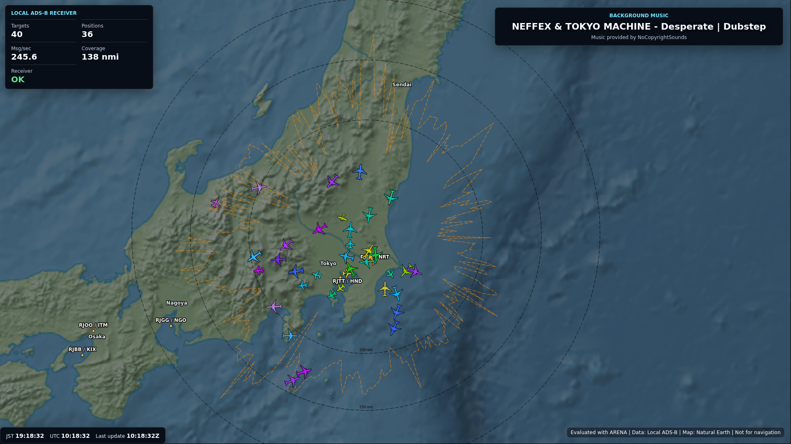
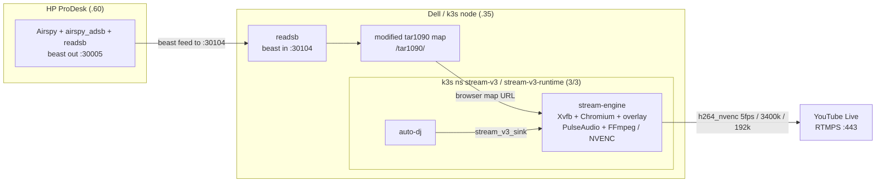
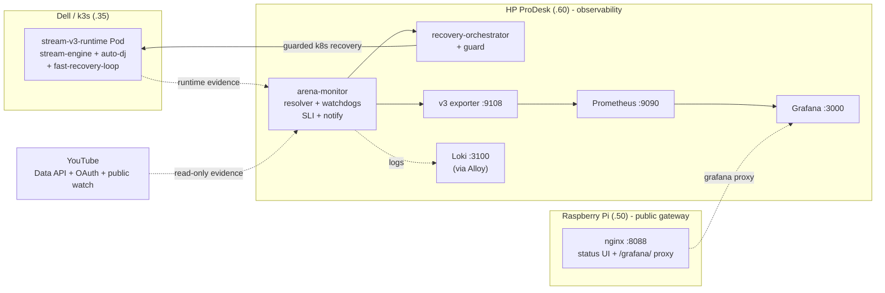

# stream_v3

[](https://github.com/yukimurata0421/live-stream-systems-case-study/actions/workflows/public-snapshot-check.yml)
[](pyproject.toml)
[](LICENSE)

[](https://www.youtube.com/@yukimurata0421/live)

**Live stream:** <https://www.youtube.com/@yukimurata0421/live>

This repository publishes `stream_v3` as a public systems case study for a
self-built 24/7 YouTube Live pipeline. ADS-B visualization and NCS music are the
workload; the primary focus is pipeline development, SLI-based monitoring,
observability, recovery guard design, and operational decision-making.

This is open-source code published as a case study, not a supported OSS product
or general-purpose starter.

## What This Repository Demonstrates

- 24/7 YouTube Live delivery operation.
- ADS-B source-chain boundary: Airspy on HP ProDesk, `airspy_adsb`, readsb,
  Dell-side readsb and a modified tar1090 map endpoint, then `stream_v3`
  delivery.
- Failure classification across rendering, audio, FFmpeg, RTMPS, API, and
  monitoring paths.
- Delivery-plane / observability-plane separation across Dell workstation and
  HP ProDesk hardware.
- HP ProDesk observability role: YouTube resolver/watchdog, stream watchdog,
  subsystem SLI, notifications, Prometheus exporter, and recovery orchestrator.
- Raspberry Pi public gateway role: nginx status UI and `/grafana/` proxy, while
  Prometheus and Loki remain on HP ProDesk.
- Recovery guard design that keeps monitors from directly owning FFmpeg.
- Shadow mode and cutover safety before destructive actions.
- `ops/monitoring` evidence path with Prometheus, Loki, Grafana, and Alloy
  configuration.
- YouTube API quota-aware monitoring.
- Contract tests for unsafe recovery prevention and stale evidence handling.

| What breaks | How stream_v3 protects it |
| --- | --- |
| Airspy, `airspy_adsb`, ProDesk readsb, or the Dell readsb / modified tar1090 map feed gets stale. | Source freshness is treated as ADS-B evidence, separate from browser/audio/encoder failure. |
| Browser, audio, FFmpeg, RTMPS, or GPU encoding stalls. | The Dell `stream_v3` k3s delivery tier owns local runtime recovery without giving monitors direct FFmpeg ownership. |
| YouTube API/public evidence, k3s runtime evidence, or monitoring state gets stale or misleading. | The HP ProDesk observability tier pulls read-only YouTube and runtime evidence, applies quota/freshness guards, and only then requests staged k3s recovery. |
| The public status or dashboard entrypoint gets confused with the monitoring backend. | Raspberry Pi serves the public nginx status/gateway layer; Prometheus, Loki, Alloy, and the v3 exporter remain on HP ProDesk. |

### Delivery Path



### Observability & Recovery



The diagrams intentionally separate delivery from observation. The concrete
ADS-B data path is Airspy on HP ProDesk -> `airspy_adsb` -> ProDesk readsb ->
Dell workstation readsb -> Dell modified tar1090 -> `stream_v3`. Evidence
collection is dotted in the observability diagram; the only mutating path back
to delivery is the guarded k8s recovery request. The HP ProDesk monitor
collects runtime evidence from the Dell pod with `kubectl exec`. Raspberry Pi is
the public status and dashboard gateway, not the Prometheus/Loki owner; those
backends remain on HP ProDesk.

This repository is a sanitized public snapshot of a system that evolved through
three stages:

- `stream`: first single-machine streaming prototype.
- `stream_v2`: refactored single-host runtime with watchdogs, SLI, recovery
  policy, and runbooks.
- `stream_v3`: current k3s runtime that splits delivery from observation.

The project is not a generic starter template. It is a case study in operating a
small but real 24/7 streaming system: browser rendering, PulseAudio, AutoDJ,
FFmpeg, NVIDIA NVENC, YouTube health checks, restart budgets, API quota guards,
Prometheus metrics, runbooks, and rollback-aware deployment.

## Why k3s

The single-host versions made browser rendering, audio, FFmpeg, watchdogs, and recovery compete for the same resources and process ownership. k3s gives the delivery workload a hard runtime boundary while the HP ProDesk observability plane keeps long-window evidence and recovery decisions outside the FFmpeg owner.

## Architecture

The main design decisions are summarized in `docs/v3/decisions.md`.
The hiring-oriented review path is in `docs/hiring-reviewer-guide.md`.
The compact design decision table is in `docs/design-decisions-for-review.md`.
The physical deployment topology is documented in `docs/physical-topology.md`.
The short evolution narrative is in `docs/evolution.md`.

In code, the Airspy/readsb source chain is represented by the browser map
upstream contract. The k3s runtime does not manage the Airspy device directly;
it renders and proxies the Dell readsb / modified tar1090 endpoint through
`src/stream_core/overlay_server.py` and validates that path with report-only
overlay and upstream checks.

## Reviewer Shortcuts

Use these entry points instead of reading the full tree:

| Review question | Direct links |
| --- | --- |
| What prevents unsafe staged recovery? | [`src/stream_v2/recovery_orchestrator/gate.py`](src/stream_v2/recovery_orchestrator/gate.py), [`ops/scripts/v3_shadow_acceptance.py`](ops/scripts/v3_shadow_acceptance.py) |
| Where is shadow safety asserted? | [`tests/test_v3_shadow_acceptance.py`](tests/test_v3_shadow_acceptance.py), [`deploy/k3s/README.md`](deploy/k3s/README.md) |
| Where is the physical split documented? | [`docs/physical-topology.md`](docs/physical-topology.md), [`docs/runtime-contract.md`](docs/runtime-contract.md) |
| Where was the stats reuse bug fixed? | [`src/watchers/video_resolver/cache.py`](src/watchers/video_resolver/cache.py), [`src/watchers/youtube_watchdog_core/cache.py`](src/watchers/youtube_watchdog_core/cache.py), [`tests/test_youtube_video_id_resolver_cache_freshness.py`](tests/test_youtube_video_id_resolver_cache_freshness.py), [`tests/test_youtube_watchdog_cache_freshness.py`](tests/test_youtube_watchdog_cache_freshness.py) |

## External Validation

- A Reddit post introducing the livestream reached the #1 post position on
  r/ADSB for the day, according to Reddit Post Insights. The insight screen
  showed the post title "24/7 ADS-B livestream from Japan with custom evaluation pipeline (ARENA)" and about 1.2K views.
  Evidence: [`docs/assets/reddit-adsb-post-insights-2026-05.png`](docs/assets/reddit-adsb-post-insights-2026-05.png).
- An external reviewer found a stats reuse bug in the YouTube resolver/watchdog path; the fix now prefers per-probe checked timestamps over the top-level stats timestamp and is covered by cache freshness tests.

## What To Look At

- `src/stream_v3/`: v3 control loop and runtime entrypoint.
- `src/stream_core/`: delivery runtime, FFmpeg lifecycle, CLI, diagnostics,
  notifications, and supervisor abstractions.
- `src/watchers/`: YouTube, stream, network, evidence, and recovery monitors.
- `deploy/k3s/`: k3s manifests, shadow mode, streaming overlay, observer, and
  cutover guard.
- `ops/monitoring/`: Prometheus, Loki, Grafana, and Alloy monitoring config.
- `ops/systemd/stream-v3-arena-monitor.service`: observability-plane task owner.
- `ops/prodesk-monitoring/`: sanitized legacy prodesk service checks.
- `docs/v3/`: current runtime contracts, decisions, runbooks, SLI notes, and
  program map.
- `tests/`: contract and policy tests for runtime safety and monitoring logic.

## Local Validation

These checks do not require publishing to YouTube:

```bash
python3 ops/scripts/validate_k3s_manifests.py
python3 ops/scripts/v3_shadow_acceptance.py
pytest tests/test_v3_k3s_preflight.py tests/test_stream_v3_control_loop.py
```

Production-like use requires local secrets and host-specific devices, so the
public repository intentionally defaults to examples and shadow/test paths.

The GitHub Actions workflow
`.github/workflows/public-snapshot-check.yml` is a public evidence check, not a
production deployment pipeline. It runs compile checks, k3s manifest validation,
shadow acceptance, and focused safety/freshness tests without secrets or live
YouTube mutation.

## Public Snapshot Notes

This tree excludes runtime state, logs, media files, local capture artifacts,
virtual environments, and real credentials. See `docs/public-release.md` for the
public-release boundary.

The public runtime contract is documented in `docs/runtime-contract.md`.

## Support

This is a public case-study repository, not a supported package, service, or
starter template. Issues, if enabled after publication, are limited to public
documentation defects, reproducible validation failures, and sanitized
portability notes.

There is no uptime promise, incident response promise, installation support, or
guarantee that this system fits another production environment. Do not post
stream keys, OAuth tokens, Discord webhooks, SSH keys, private hostnames, or
runtime state copied from `.state/`.

## Contributions

This repository is not trying to become a general-purpose OSS project. Small
pull requests may be considered when they improve the public case study without
changing its operational boundary: documentation clarity, safer examples,
manifest validation, focused tests, and sanitized portability notes.

Before opening a pull request:

- keep changes small and explain the operational reason;
- run `python3 ops/scripts/validate_k3s_manifests.py`;
- run `python3 ops/scripts/v3_shadow_acceptance.py` when touching runtime or
  monitoring behavior;
- keep secrets and real operational data out of commits;
- preserve the delivery-plane / observability-plane ownership split unless the
  PR explicitly argues for a documented design change.

## License

MIT License. See `LICENSE`.
