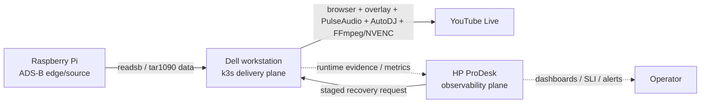

# stream_v3

[](https://www.youtube.com/@yukimurata0421/live)

**Live stream:** <https://www.youtube.com/@yukimurata0421/live>

Production-shaped ADS-B YouTube streaming platform with a k3s delivery plane
and a separate HP ProDesk observability plane.

| What breaks | How stream_v3 protects it |
| --- | --- |
| ADS-B source or map data gets stale. | The Raspberry Pi source tier is isolated from delivery and classified as source evidence. |
| Browser, audio, FFmpeg, RTMPS, or GPU encoding stalls. | The Dell k3s delivery tier owns local runtime recovery without giving monitors direct FFmpeg ownership. |
| Monitoring evidence gets stale, becomes misleading, or requests the wrong action. | The HP ProDesk observability tier stages recovery through guards, shadow checks, SLI, and freshness tests. |



This repository is a sanitized public snapshot of a system that evolved through
three stages:

- `stream`: first single-machine streaming prototype.
- `stream_v2`: refactored single-host runtime with watchdogs, SLI, recovery
  policy, and runbooks.
- `stream_v3`: current k3s runtime that splits delivery from observation.

The project is not a generic starter template. It is a case study in operating a
small but real 24/7 streaming system: browser rendering, PulseAudio, AutoDJ,
FFmpeg, NVIDIA NVENC, YouTube health checks, restart budgets, API quota guards,
Prometheus metrics, runbooks, and rollback-aware deployment.

## Why k3s

The single-host versions made browser rendering, audio, FFmpeg, watchdogs, and recovery compete for the same resources and process ownership. k3s gives the delivery workload a hard runtime boundary while the HP ProDesk observability plane keeps long-window evidence and recovery decisions outside the FFmpeg owner.

## Architecture

The main design decisions are summarized in `docs/v3/decisions.md`.
The physical deployment topology is documented in `docs/physical-topology.md`.
The short evolution narrative is in `docs/evolution.md`.

## Reviewer Shortcuts

Use these entry points instead of reading the full tree:

| Review question | Direct links |
| --- | --- |
| What prevents unsafe staged recovery? | [`src/stream_v2/recovery_orchestrator/gate.py`](src/stream_v2/recovery_orchestrator/gate.py), [`ops/scripts/v3_shadow_acceptance.py`](ops/scripts/v3_shadow_acceptance.py) |
| Where is shadow safety asserted? | [`tests/test_v3_shadow_acceptance.py`](tests/test_v3_shadow_acceptance.py), [`deploy/k3s/README.md`](deploy/k3s/README.md) |
| Where is the physical split documented? | [`docs/physical-topology.md`](docs/physical-topology.md), [`docs/runtime-contract.md`](docs/runtime-contract.md) |
| Where was the stats reuse bug fixed? | [`src/watchers/video_resolver/cache.py`](src/watchers/video_resolver/cache.py), [`src/watchers/youtube_watchdog_core/cache.py`](src/watchers/youtube_watchdog_core/cache.py), [`tests/test_youtube_video_id_resolver_cache_freshness.py`](tests/test_youtube_video_id_resolver_cache_freshness.py), [`tests/test_youtube_watchdog_cache_freshness.py`](tests/test_youtube_watchdog_cache_freshness.py) |

## External Validation

- The live ADS-B stream reached #1 on Reddit r/ADSB, giving the output public feedback outside the local lab.
- An external reviewer found a stats reuse bug in the YouTube resolver/watchdog path; the fix now prefers per-probe checked timestamps over the top-level stats timestamp and is covered by cache freshness tests.

## What To Look At

- `src/stream_v3/`: v3 control loop and runtime entrypoint.
- `src/stream_core/`: delivery runtime, FFmpeg lifecycle, CLI, diagnostics,
  notifications, and supervisor abstractions.
- `src/watchers/`: YouTube, stream, network, evidence, and recovery monitors.
- `deploy/k3s/`: k3s manifests, shadow mode, streaming overlay, observer, and
  cutover guard.
- `ops/monitoring/`: Prometheus, Loki, Grafana/Alloy-style monitoring config.
- `ops/systemd/stream-v3-arena-monitor.service`: observability-plane task owner.
- `ops/prodesk-monitoring/`: sanitized legacy prodesk service checks.
- `docs/v3/`: current runtime contracts, decisions, runbooks, SLI notes, and
  program map.
- `tests/`: contract and policy tests for runtime safety and monitoring logic.

## Local Validation

These checks do not require publishing to YouTube:

```bash
python3 ops/scripts/validate_k3s_manifests.py
python3 ops/scripts/v3_shadow_acceptance.py
pytest tests/test_v3_k3s_preflight.py tests/test_stream_v3_control_loop.py
```

Production-like use requires local secrets and host-specific devices, so the
public repository intentionally defaults to examples and shadow/test paths.

The GitHub Actions workflow
`.github/workflows/public-snapshot-check.yml` is a public evidence check, not a
production deployment pipeline. It runs compile checks, k3s manifest validation,
shadow acceptance, and focused safety/freshness tests without secrets or live
YouTube mutation.

## Public Snapshot Notes

This tree excludes runtime state, logs, media files, local capture artifacts,
virtual environments, and real credentials. See `docs/public-release.md` for the
public-release boundary.

The public runtime contract is documented in `docs/runtime-contract.md`.

## Support

This is a public case-study repository, not a supported production package.
Questions, portability reports, and documentation issues are welcome through
GitHub Issues once the repository is published.

When asking for help, include the command you ran, the expected result, the
actual result, and the relevant sanitized logs or config snippets. Do not post
stream keys, OAuth tokens, Discord webhooks, SSH keys, private hostnames, or
runtime state copied from `.state/`.

## Contributions

Contributions are welcome when they make the public snapshot easier to read,
test, or adapt. Good first areas are documentation, manifest validation,
observability examples, test coverage, and portability notes for non-k3s
clusters.

Before opening a pull request:

- keep changes small and explain the operational reason;
- run `python3 ops/scripts/validate_k3s_manifests.py`;
- run `python3 ops/scripts/v3_shadow_acceptance.py` when touching runtime or
  monitoring behavior;
- keep secrets and real operational data out of commits;
- preserve the delivery-plane / observability-plane ownership split unless the
  PR explicitly argues for a documented design change.

## License

MIT License. See `LICENSE`.
