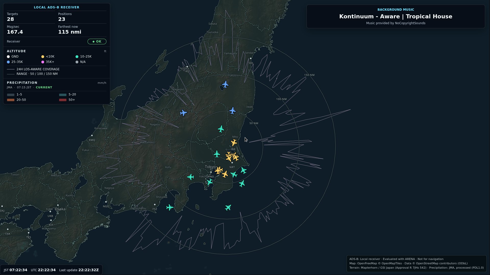
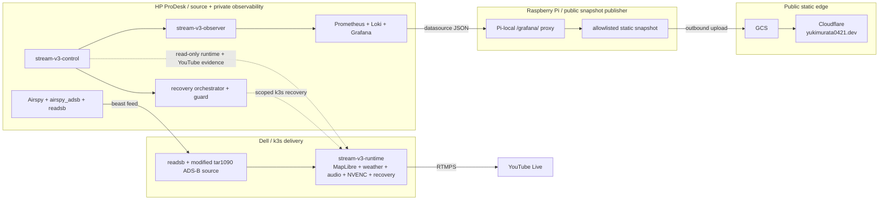

# stream_v3

[](https://github.com/yukimurata0421/live-stream-systems-case-study/actions/workflows/public-snapshot-check.yml)
[](pyproject.toml)
[](LICENSE)

[](https://www.youtube.com/@yukimurata0421/live)

**Live stream:** <https://www.youtube.com/@yukimurata0421/live>

**Public status snapshot:** <https://yukimurata0421.dev/>

This is open-source code published as a reliability engineering case study, not
a supported streaming product or general-purpose starter.

## 30-Second Summary

`stream_v3` is a self-built 24/7 YouTube Live pipeline for ADS-B visualization
and NCS music. Its current renderer combines a custom MapLibre aircraft map,
analysis-only JMA precipitation, and explicit render readiness. The engineering
focus is same-watch-URL continuity, SLI-based monitoring, fault classification,
bounded recovery authority, and public-safe status publication.

The system runs across three home hosts:

- an HP ProDesk owns the Airspy/readsb source and private k3s observability
  workloads;
- a Dell workstation owns the k3s delivery runtime, browser/audio/FFmpeg, and
  local fast recovery;
- a Raspberry Pi pulls allowlisted evidence through its local Grafana proxy and
  publishes a static snapshot to GCS, which Cloudflare serves publicly.

This is a single-operator system with a small blast radius. Its value is the
explicit evidence and safety boundaries, not enterprise scale.

## Evidence Snapshot

**Approximately 80 days on one public YouTube Live URL.** The same public Live
identity was preserved from the initial measurement checkpoint through the
production cutover from the v2 single-host runtime to the v3 k3s split-plane
architecture, with no selected replacement action observed.

| Continuity evidence | Measured value |
| --- | --- |
| Measurement start | `2026-05-06 10:36:17 JST` |
| Measurement endpoint | `2026-07-25 08:22:08 JST` (`79 days, 21 hours, 45 minutes`) |
| Expected video ID | `OpMzOBFwM7M` |
| Current selected video ID | `OpMzOBFwM7M` |
| Observed replacement actions | `0` across the retained review windows |
| Candidate-new-URL samples | `2` transient samples in the initial 14-day window; neither was selected |
| V2 stopped | `2026-05-28 22:29:43 JST` |
| First retained V3 production-send evidence | `2026-05-28 22:41:31 JST` |
| Cutover video ID check | V2 final resolver and V3 first public identity evidence both selected `OpMzOBFwM7M` |

This establishes URL identity preservation, not uninterrupted frame delivery.
The exact production-authority handoff was not logged as a standalone event,
and the retained V2-stop to V3-send evidence gap is `11 minutes, 48 seconds`.
The detailed evidence and counting boundaries are in the
[same-URL SLI case study](docs/28-day-same-url-sli-case-study.md).

| Signal | Measured result | Boundary |
| --- | --- | --- |
| k3s service restart drill | 10.7 seconds to observability metrics OK; the FFmpeg PID and TCP socket survived, and `bytes_sent` advanced by 37,503,068 bytes. | This was not a node reboot, disk restore, or RTMPS reconnect drill. |
| Viewer-facing drill signals | YouTube ingest, public watch, same URL, and watchdog metrics stayed OK in the sampled window. | Sampling does not prove every delivered frame. |
| Transport MTTR baseline | Historical `tcp_stall` clusters: 90.0s median, 1190.8s p95, 1474.0s max local transport MTTR. | Local transport MTTR is not direct viewer MTTR. |
| 28-day same-URL review | Replacement actions `0`; strict v3 same-URL samples `6558 / 6568`, `99.848%`. | This is a retained historical window, not a current uptime promise. |

The measured, tested, documented, and unknown status of each claim is kept in
the [operational scorecard](docs/operational-scorecard.md).

## System Architecture


```mermaid
flowchart LR
    subgraph PD["HP ProDesk / source + private observability"]
        AIR["Airspy + airspy_adsb + readsb"]
        MON["stream-v3-control"]
        EXP["stream-v3-observer"]
        GRAF["Prometheus + Loki + Grafana"]
        GUARD["recovery orchestrator + guard"]
        MON --> EXP --> GRAF
        MON --> GUARD
    end

    subgraph DELL["Dell / k3s delivery"]
        RS["readsb + modified tar1090 ADS-B source"]
        RUN["stream-v3-runtime<br/>MapLibre + weather + audio + NVENC + recovery"]
        RS --> RUN
    end

    subgraph PI["Raspberry Pi / public snapshot publisher"]
        PROXY["Pi-local /grafana/ proxy"]
        BUILD["allowlisted static snapshot"]
        PROXY --> BUILD
    end

    subgraph EDGE["Public static edge"]
        GCS["GCS"]
        CF["Cloudflare<br/>yukimurata0421.dev"]
        GCS --> CF
    end

    YT["YouTube Live"]

    AIR -->|"beast feed"| RS
    RUN -->|"RTMPS"| YT
    MON -. "read-only runtime + YouTube evidence" .-> RUN
    GUARD -. "scoped k3s recovery" .-> RUN
    GRAF -->|"datasource JSON"| PROXY
    BUILD -->|"outbound upload"| GCS
```

The public status path is static. Public readers do not reach the private
Grafana, Prometheus, Loki, home network, or delivery runtime. The Raspberry Pi
is a publisher, not a k3s node or monitoring backend. Detailed host and runtime
contracts are in [physical topology](docs/physical-topology.md) and
[runtime contract](docs/runtime-contract.md).

## Key Design Decisions

- `SV3-SAME-URL`: preserve the current YouTube watch URL when a fault is
  recoverable; replacement is never inferred from transport noise alone.
- `SV3-RECOVERY-GUARD`: monitors collect evidence and request staged recovery,
  while the delivery tier retains FFmpeg ownership.
- `SV3-PUBLIC-BOUNDARY`: publish only an allowlisted static snapshot through
  GCS and Cloudflare.
- `SV3-EVIDENCE-STRENGTH`: keep restart observation separate from confirmed TCP
  send recovery; stale, missing, or ambiguous evidence cannot claim recovery.
- Treat API quota exhaustion and public-probe failures as degraded evidence,
  not immediate proof of stream failure.
- Keep ADS-B source freshness, visual correctness, audio correctness, upload
  pressure, and YouTube lifecycle state as separate fault domains.
- Keep the map runtime probe, public-viewer frame probe, and precipitation
  health read-only; repeated visual evidence must be correlated before recovery.

## Claims And Limits

| Claim ID | What the repository supports | What it does not claim |
| --- | --- | --- |
| `SV3-SAME-URL` | Historical same-URL windows and zero selected replacement actions. | Contractual availability or continuous frame-by-frame auditing. |
| `SV3-RECOVERY-GUARD` | Public policy tests, shadow acceptance, and scoped recovery command rendering. | Live production mutation from public CI or ideal multi-node HA. |
| `SV3-PUBLIC-BOUNDARY` | Static GCS/Cloudflare publication with private monitoring kept off the public path. | Public Grafana, raw logs, credentials, or home-network ingress. |
| `SV3-EVIDENCE-STRENGTH` | Notifications distinguish restart observed, recovery unconfirmed, and TCP send recovery confirmed. | CPE-versus-carrier ownership or exact viewer impact from a notification alone. |

Production state, logs, media, packet captures, credentials, and host-specific
configuration are intentionally excluded. The full publication boundary is
documented in [public release notes](docs/public-release.md).

## Review Paths

Use one of these three entry points:

1. [Hiring reviewer guide](docs/hiring-reviewer-guide.md) for a role-specific
   reading path.
2. [Operational scorecard](docs/operational-scorecard.md) for measured, tested,
   documented, and unknown claims.
3. [Implementation review map](docs/implementation-review-map.md) to connect
   reliability claims to code and tests.

Local non-mutating validation:

```bash
python3 ops/scripts/validate_k3s_manifests.py
python3 ops/scripts/v3_shadow_acceptance.py
python3 -m pytest -q
```

The public workflow compiles the code, validates manifests and shadow behavior,
and runs the full deterministic test suite. It does not publish to YouTube,
install host units, or mutate a production cluster.
