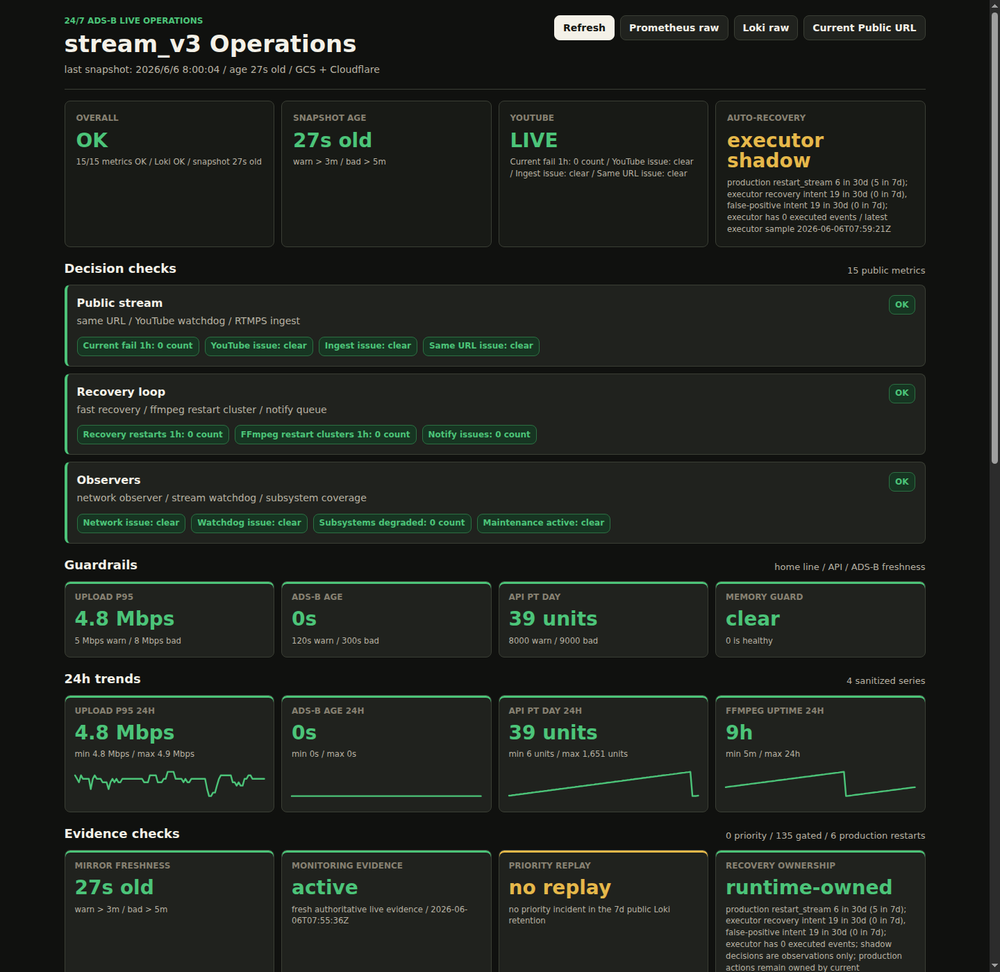

# Public Status Snapshot

Public site: <https://yukimurata0421.dev/>

This page is the public evidence surface for `stream_v3`. It is intentionally
not a source-code release of the site implementation. The point is to show the
operational boundary: production observability stays private, while a reduced
static snapshot gives outside readers enough current context to evaluate the
stream without exposing internal dashboards or logs.

The screenshot is a dated UI example, not an uptime proof. The live page should
be read together with the freshness fields it displays.

## Why This Exists

The main repository already documents SLI windows, recovery guards, TCP stall
splitting, encoder/upload trade-offs, and single-node DR boundaries. The public
status page adds a different kind of evidence: it shows that those signals can
be reduced into a safe external view.

The design goal is not to publish raw production observability. It is to expose
enough state for review while keeping production backends, credentials, host
paths, private addresses, generated logs, and unsanitized event payloads out of
the public repository.

## Information Layout

The page front-loads the questions a reviewer should ask first:

- Overall state and snapshot age.
- YouTube-facing state: live URL, ingest, watchdog, and same-URL continuity.
- Auto-recovery boundary: production actions versus shadow executor
  observations.
- Decision checks for public stream, recovery loop, and observers.
- Guardrails for upload p95, ADS-B source freshness, API burn, and memory.
- 24-hour trend cards for public-safe series.
- Evidence checks for mirror freshness, authoritative monitoring evidence,
  priority replay, current classifier replay, and recovery ownership.

This keeps the page operational instead of promotional. A green page means the
published snapshot is fresh and the public-safe checks are currently OK; it does
not claim that every private metric is exposed or that every delivered frame was
audited.

## Architecture Boundary

The production monitoring stack remains private. The public path is a reduced
snapshot pipeline:

1. Private Prometheus/Loki/Grafana evidence remains on HP ProDesk.
2. The Raspberry Pi-side collector initiates HTTP GETs to the Pi-local
   `http://127.0.0.1:8088/grafana` path.
3. Pi nginx proxies those requests to HP ProDesk Grafana at
   `192.168.0.60:3000/grafana`.
4. HP ProDesk Grafana serves datasource proxy JSON from private Prometheus/Loki
   evidence, and the JSON response returns over the same Pi nginx path.
5. A Raspberry Pi-side collector emits allowlisted JSON fields for public
   display.
6. Static assets and sanitized JSON are pushed outbound from Raspberry Pi to
   GCS.
7. Cloudflare serves the public domain and applies short cache lifetimes.

There is no reason for public browsers to reach the home network, Grafana,
Prometheus, Loki, or the k3s runtime directly. Generated JSON snapshots are also
not committed to this repository; they are live artifacts with freshness
semantics, not source files.

This boundary is specifically for `yukimurata0421.dev`. Existing
`adsb-open.addevlab.com` Grafana shortcuts are separate Cloudflare Tunnel routes
back to Raspberry Pi nginx and then HP ProDesk Grafana. Pi nginx shortcut paths
such as `/stream-v3-grafana` redirect into that tunnel path; they are not used
by the static snapshot collector or the `yukimurata0421.dev` publication path.

## What To Evaluate

- The page makes stale evidence visible instead of hiding it behind a static
  "healthy" label.
- Public stream state, recovery state, source freshness, API usage, and memory
  guardrails are separated.
- Shadow recovery observations are not presented as production authority.
- Historical `production_without_shadow` gaps stay visible when
  `current_classifier_replay` explains current classifier coverage.
- The public surface is useful for review without becoming an operational secret
  inventory.
- The site complements this repository instead of replacing the measured SLI and
  incident-review documents.
